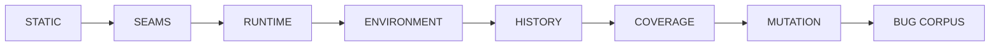

<div align="center">

<!-- trace:v1 id=doc.bug-hunt work=WORK-BUG-4ABH9VEY documents=REQ-BUG-KZG483AX -->
# BugHunt

**A tool that did not run is never reported as clean.**

[](https://github.com/carterlasalle/bughunt/actions/workflows/ci.yml)
[](.python-version)
[](https://docs.astral.sh/uv/)
[](LICENSE)

[Quick start](#quick-start) · [Commands](#commands) · [Policy rules](DEFAULT_RULES.md) · [Complexity](COMPLEXITY.md) · [Contributing](#contributing) · [Changelog](CHANGELOG.md)

</div>

## v0.6.0 runtime, seam, environment, and history correctness

BugHunt 0.6.0 adds the missing runtime/behavior layers around the static stack: branch coverage, runtime Typeguard verification, randomized test/hash order, timezone/locale/interpreter matrices, concurrency and async-blocking checks, HypoFuzz, packaging verification, public-API/version differentials, seam/contract drift detection, cross-tool disagreement, non-destructive deduplication, and a coverage-weighted risk map. Raw analyzer evidence is always preserved.

The correctness model is now:



See `SEAM_CORRECTNESS.md`, `BUG_TAXONOMY.md`, and `DETERMINISTIC_SIMULATION.md`.

BugHunt now discovers repository technologies before selecting non-Python engines. GitHub Actions, shell, env files/access, OpenAPI, Protobuf, SQL/PostgreSQL migrations, Docker, Terraform, Go, Rust, C/C++, PHP, JavaScript/TypeScript, and React each activate a bug-focused analyzer layer only when evidence exists. Irrelevant engines are `N/A` and do not lower defense health; applicable engines that cannot run are real `SKIPPED` blind spots. OpenAPI and Protobuf also receive Git-baseline compatibility checks. See `TECHNOLOGY_ENGINES.md`.

`all`/`full`/`skipmutmut` discover capabilities before installing technology-specific tools, so a Python-only project does not pull in Rust/C++/Terraform ecosystems. `skipmutmut` remains the maximal practical scan when mutation testing would dominate runtime.

## v0.5.0 default correctness policy + complexity

BugHunt now ships a native repository policy pack in addition to the external analyzers. `uv run bughunt rules` lists every built-in rule. `configure --auto` generates a managed environment contract, round-trip/property campaigns when evidence permits, architecture and fault-coverage configuration, and strict analyzer overlays. PR/deep/all profiles now include native cyclomatic/LOC/ABC/asset budgets plus independent Complexipy, Radon, and Lizard complexity checks.

`all` and its `full` alias install missing analyzers by default, auto-configure the repository, run every defense, show deterministic autofix counts, and write an agent repair queue.

BugHunt is a defense-in-depth bug-finding orchestrator for Python-heavy repositories. It does not replace Ruff, type checkers, Semgrep, CodeQL, Pysa, CrossHair, pytest/Hypothesis, mutation testing, fuzzers, or Bug Corpus. It runs those defenses together, keeps live status while they work, normalizes findings, highlights repeated signals/hot files, and produces a repair queue that another coding agent can work through deterministically.

The key rule is simple: **a tool that did not run is never reported as clean**.

## Quick start

```bash
uv sync
uv run bughunt doctor
uv run bughunt install
uv run bughunt configure --auto
uv run bughunt all
# Full scan without the very expensive mutation stage:
uv run bughunt skipmutmut
```

<!-- trace:exempt reason=repo-scaffolding-no-product-behavior -->
### Prerequisites

- `uv` (any recent release), Python 3.12 (pinned in `.python-version`;
  the package supports `>=3.11`), and git.
- No environment variables are required. `SEMGREP_APP_TOKEN` is optional
  (see `.env.example`); without it Semgrep runs `--oss-only`.

Contributor verification (see `CONTRIBUTING.md`):

```bash
uv run coverage run -m pytest -q && uv run coverage report
uv run ruff check src tests     # advisory until lint debt is cleared
uv run mypy src                 # advisory until type debt is cleared
uv build                        # wheel + sdist sanity check
```

Or install missing tools immediately before the maximal scan:

```bash
uv run bughunt all --install-missing
```

## Commands

```text
bughunt doctor
    Show installed analyzers, detected repository capabilities, applicable/N/A technology engines, strict-config readiness, semantic targets, complexity coverage, and remaining blind spots.

bughunt rules
    List the shipped BugHunt-native default rules and intentional overlaps.

bughunt install
    Install the Python analysis stack with `uv add --dev` when the target is a
    uv project. Each package is installed independently so one incompatible
    optional analyzer cannot block the rest. On macOS with Homebrew it also
    installs CodeQL and best-effort Watchman.

bughunt install --dry-run
    Print what would be installed without changing the project.

bughunt configure --auto
    Generate/refresh paranoid configs for Ruff, basedpyright, mypy, ty, Pyrefly,
    Pylint (+ bundled extensions), Bandit, Import Linter, ast-grep, Pysa,
    Hypothesis, mutmut and Schemathesis; inventory repo technologies and generate applicable SQL/Terraform/Docker/JS/PHP overlays; infer source/test roots; then discover
    fuzz/API targets, Pysa wrapper models, differential oracles, round-trip and
    metamorphic properties, and fault-injection coverage campaigns. High-confidence
    semantic campaigns are persisted as managed [[custom.checks]] entries.

bughunt quick
bughunt run --profile fast
    Low-latency syntax/lint/type defenses.

bughunt pr
bughunt run --profile pr
    Broad static, semantic, symbolic, and test defenses.

bughunt deep
bughunt run --profile deep
    Whole-program, taint, mutation, fuzzing, and custom defenses too.

bughunt run --profile all
bughunt all
bughunt full
bughunt skipmutmut
    Run every defense known to BugHunt. `skipmutmut` is exactly `all` minus mutmut. `all`/`full` install missing analyzers
    by default, refresh strict configs and safe auto-discovered targets, then
    execute the complete stack. Pass `--no-install-missing` only when desired.
```


## Shipped correctness policy

The built-in policy layer covers high-confidence control-flow hazards, environment/configuration drift, secret leakage from `.env.example`, private/persistence implementation boundaries, export/import and backup/restore round-trip obligations, and several forms of implementation-coupled testing. The critical `finally` jump rule is deliberately enforced three ways: BugHunt native AST analysis, the shipped ast-grep rule, and Ruff `B012`.

See [`DEFAULT_RULES.md`](DEFAULT_RULES.md). Complexity budgets and anti-gaming guidance are in [`COMPLEXITY.md`](COMPLEXITY.md).

## Paranoid analyzer configuration

`configure --auto` is no longer just fuzz-target discovery. It writes BugHunt-owned strict overlays under `.bughunt/configs/` and the runner explicitly points each analyzer at them. Ruff is literal `ALL` + preview; basedpyright uses `all` and bans `Any`/`Unknown`; mypy uses strict plus additional optional checks and follows untyped imports; ty uses every rule as an error; Pyrefly uses its `all` preset; Pylint loads every public extension bundled with the installed version; Bandit runs all installed checks; Import Linter gets a safe generic acyclic-package invariant; Pysa gets a valid base taint framework; Hypothesis and Schemathesis get deep-search profiles.

Pure style findings are not disabled. They remain in reports but rank below correctness/security issues so they cannot bury likely defects. BugHunt also force-excludes `.bughunt/runtime`, `.venv`, build artifacts and other non-first-party trees from broad scanners.

See [`STRICT_CONFIGS.md`](STRICT_CONFIGS.md) for the tool-by-tool audit and exact reasoning.

## Live progress / stuck detection

Long runs no longer disappear behind a blank terminal. While the scan is active, BugHunt renders a live heartbeat table showing every currently running defense, its category, elapsed time, configured timeout, recent completions, and whether a stage is approaching its timeout.

Example shape:

```text
╭──────────────────────────── LIVE BUG HUNT ────────────────────────────╮
│ STATE       DEFENSE                 CLASS             ELAPSED  HEARTBEAT│
│ ▶ RUNNING   codeql-db               whole-program     42.8s   ● alive  │
│ ▶ RUNNING   atheris:auto:parse_msg  coverage-fuzz     31.4s   ● alive  │
│ ✓ PASS      basedpyright            types              2.1s   complete │
│ ◆ FOUND     semgrep                 semantic-static    6.8s   17 hits  │
╰────────────────────────────────────────────────────────────────────────╯
```

Heavy CodeQL/Pysa/mutation stages are kept serial after the broad parallel pass so a deep scan does not accidentally make all three fight for RAM/CPU at once.

## What `all` runs

The maximal profile knows about:

- Python compilation
- Ruff
- basedpyright
- mypy
- ty
- Pyrefly
- Pylint
- Vulture
- Bandit
- deptry
- import-linter
- ast-grep
- Semgrep
- CodeQL Python `security-and-quality`
- Pysa / Pyre taint analysis
- deal contract linting
- CrossHair symbolic execution
- pytest + whatever Hypothesis/state-machine tests are already in the suite
- mutmut
- integrated Bug Corpus placeholder / V2 coverage gap
- Schemathesis
- Atheris
- arbitrary configured differential / metamorphic / fault-injection / state-machine checks

Every one becomes `PASS`, `FINDINGS`, `ERROR`, or `SKIPPED`.

## Automatic Atheris configuration

`bughunt configure --auto` scans Python ASTs for parser/decoder/validator-like boundaries that are safe enough to fuzz automatically. It supports module-level functions and static/class methods when invocation is unambiguous. A target must have exactly one required fuzz input and either an explicit bytes/string-like annotation or consistent literal call-site evidence from tests.

Generated harnesses treat explicit parser exceptions plus a conservative set of malformed-input rejection exceptions (`ValueError`, Unicode errors, EOF, and format-library errors when directly observed) as rejected inputs rather than crashes; assertions and unexpected exception classes still escape to Atheris.

For each target, BugHunt writes a real Atheris harness under:

```text
.bughunt/generated/atheris/
```

The harness instruments the target import, converts raw fuzzer bytes appropriately, and treats exception classes explicitly raised by that function as expected invalid-input exits. Unexpected exceptions are left uncaught so Atheris can report them as crashes. BugHunt also mines literal parser inputs already used in `tests/` and combines them with small boundary seeds (`{}`, `[]`, empty input, etc.) to bootstrap the coverage-guided corpus instead of always starting from nothing.

Generated targets use a finite `-atheris_runs=` budget so deep/all scans terminate reproducibly instead of fuzzing forever. Change `[autodiscovery].atheris_runs` in `bughunt.toml` for a larger campaign.

BugHunt intentionally does **not** auto-generate fuzzers for arbitrary multi-argument business functions. Those usually need domain-aware generators or custom mutators and are better represented as explicit targets.

## Automatic Schemathesis configuration

BugHunt uses two safe discovery strategies.

### FastAPI / ASGI

If it finds a module-level `FastAPI()` application, BugHunt generates an in-process Schemathesis pytest harness under:

```text
.bughunt/generated/schemathesis/
```

It loads `/openapi.json` directly from the ASGI app, so no development server needs to be started. The generated harness runs both:

- per-operation property-based API tests, and
- Schemathesis state-machine tests for multi-step API sequences.

The example budget comes from `[autodiscovery].schemathesis_max_examples`.

### Flask / WSGI

If BugHunt finds a module-level `Flask()` app **and** an explicit `/openapi.json`, `/swagger.json`, or `/api/openapi.json` route, it generates an in-process WSGI Schemathesis harness. It will not guess that a generic Flask app has an OpenAPI contract when no schema endpoint exists.

### OpenAPI files

BugHunt also detects OpenAPI / Swagger JSON/YAML files. It will auto-run a file only when the declared server is clearly local (`localhost`, `127.0.0.1`, etc.). A schema pointing at an unknown or remote host becomes a `REVIEW` candidate rather than something BugHunt silently attacks.

All discovery decisions are inspectable in:

```text
.bughunt/generated/targets.json
```

## Automatic semantic campaigns

BugHunt builds a small static model of module-level functions and only promotes campaigns when the evidence is strong enough to execute without inventing business semantics. Generated campaigns live under `.bughunt/generated/campaigns/` and are persisted to a bounded managed block in `bughunt.toml` as `[[custom.checks]]`. User-authored checks outside that block are preserved.

Current high-confidence generators include:

- **Differential oracles:** pairs such as `score_reference` / `score_fast`, `foo_naive` / `foo_optimized`, etc., when typed signatures match and neither implementation touches a detected external boundary. Hypothesis generates inputs and compares results/exceptions.
- **Round-trip properties:** exact typed inverse pairs such as `encode/decode`, `serialize/deserialize`, `dumps/loads`, `compress/decompress`, or `pack/unpack` when the annotations form `A -> B -> A`.
- **Metamorphic/idempotence properties:** canonical operations such as `normalize`, `canonicalize`, `dedupe`, and `clamp` when input/output types match, there is no explicit rejection path, and no external boundary is touched.
- **Fault-injection boundary coverage:** every detected first-party filesystem/network/process/database boundary is inventoried. BugHunt scans the test suite for actual injected-failure evidence (`monkeypatch`, mock `side_effect`, `pytest.raises`, timeout/OS/connection failures, etc.) and emits `BHFAULT001` for uncovered failure surfaces. This deliberately reports a coverage gap instead of guessing how the application should recover.
- **Pysa wrapper models:** direct wrappers around high-confidence sources such as `input()` and direct sink wrappers such as a parameter passed to `subprocess.run`/`os.system` are written to `.bughunt/configs/pysa/bughunt.pysa`; exact source evidence is stored in `.bughunt/generated/pysa-models.json`.

If the evidence is not strong enough, BugHunt does not create a runnable campaign just to make the dashboard green.

## Explicit custom targets

Auto-discovery is deliberately conservative. You can add stronger repo-specific targets directly.

### Atheris

```toml
[[atheris.targets]]
name = "message-parser"
command = [
  "uv", "run", "python",
  "fuzz/fuzz_message.py",
  "-atheris_runs=1000000"
]
timeout = 3600
```

### Schemathesis

```toml
[[schemathesis.targets]]
name = "local-api"
schema = "openapi.yaml"
url = "http://127.0.0.1:8000"
max_examples = 1000
timeout = 3600
```

### Differential / metamorphic / fault injection

```toml
[[custom.checks]]
name = "Reference-vs-fast projection"
category = "differential"
profile = "deep"
command = ["uv", "run", "pytest", "-q", "tests/differential"]
timeout = 3600

[[custom.checks]]
name = "Infrastructure fault matrix"
category = "fault-injection"
profile = "all"
command = ["uv", "run", "pytest", "-q", "tests/faults"]
timeout = 3600
```

## Frequency-aware signal triage

BugHunt groups findings by analyzer/rule or, when no rule ID exists, a normalized semantic message. That makes repeated issues visible immediately:

```text
Most Frequent Signals

×47  basedpyright:reportUnknownMemberType
×21  ruff:F401
×13  semgrep:project.stale-snapshot-after-await
 ×7  codeql:py/file-not-closed
```

The final dashboard also shows the hottest files by normalized finding count.

This matters because the fastest way to clear 300 findings is often to fix the **one repeated root pattern** producing 80 of them, not randomly walk the report top-to-bottom.

## Deterministic auto-fix accounting

BugHunt never applies fixes during a scan, but it records fix metadata exposed by analyzers. Ruff JSON includes every available fix plus its applicability (`safe` / `unsafe`); Semgrep JSON includes a computed replacement when a rule defines a deterministic fix. The terminal dashboard therefore shows:

```text
412 safe auto-fixable  •  37 review/unsafe auto-fixable  •  449 total deterministic fixes
```

The `Defense Rings` table has a `FIX` count per analyzer, and the report bundle adds `agent/AUTOFIX.md`. Every item in `queue.json` also carries `fixable`, `fix_safety`, and `fix_preview`.

## Agent-friendly reports

Every run creates a timestamped bundle:

```text
.bughunt/reports/YYYYMMDD-HHMMSS/
├── report.md
├── report.json
├── findings.jsonl
└── agent/
    ├── AGENT_INSTRUCTIONS.md
    ├── AUTOFIX.md
    ├── BLIND_SPOTS.md
    ├── FIX_QUEUE.md
    ├── queue.json
    └── tasks/
        ├── 0001-F821.md
        ├── 0002-reportUnknownMemberType.md
        └── ...
```

`report.json` is the complete machine-readable scan record: statuses, commands, normalized findings, repeated-signal groups, hot files, raw output, and artifacts.

`findings.jsonl` is one finding per line for streaming/tooling.

`agent/queue.json` is a sorted repair queue. Each item contains:

- stable BugHunt finding ID,
- tool / category / rule,
- path + line + column,
- normalized signal key,
- message / severity / fingerprint,
- the exact analyzer verification command,
- a small root-cause-first repair workflow.

`agent/tasks/` contains one document per repeated signal with all known locations, so an agent can choose between fixing one item or clearing a whole coherent family.

The intended agent loop is:

```text
open queue.json
→ inspect first finding / repeated cluster
→ fix root cause
→ run verification_command
→ run narrow tests
→ rerun BugHunt
→ continue
```

A real bug that escaped the existing defenses should then be taught to Bug Corpus or encoded as a property/custom detector so it cannot silently recur.

## Reports do not lie

BugHunt distinguishes:

```text
✓ PASS      analyzer executed and returned clean
◆ FINDINGS  analyzer executed and found signals
✕ ERROR     analyzer crashed, timed out, or output could not be trusted
○ SKIPPED   analyzer/target is unavailable or unconfigured
```

Skipped defenses lower the defense-health score. A repository with one passing compiler check and ten missing deep analyzers should look **poorly defended**, not `100/100`.

The score is still not a probability that the repo is bug-free.

## Installation behavior

`bughunt install` uses `uv`; it intentionally does not fall back to Poetry/pipenv/raw pip.

For a project with `pyproject.toml`, it runs independent `uv add --dev ...` installs so each analyzer sees the real target environment and one optional package failure does not block the rest.

The current Python stack includes:

```text
ruff
basedpyright
mypy
ty
pyrefly
pylint
vulture
bandit
deptry
import-linter
ast-grep-cli
semgrep
deal
crosshair-tool
pytest
hypothesis
mutmut
schemathesis
atheris
pyre-check
complexipy
radon
lizard
```

On macOS, if Homebrew is available, BugHunt also installs the CodeQL cask and best-effort Watchman for Pyre.

Run `bughunt doctor` afterward to see exactly what became usable.

## Configuration

The checked-in `bughunt.toml` contains the default profiles and budgets. Important knobs:

```toml
[execution]
max_parallel = 6
fail_on = "findings"
raw_output_limit_kb = 512

[timeouts]
fast = 120
pr = 900
deep = 7200
all = 14400

[autodiscovery]
enabled = true
atheris_runs = 500000
schemathesis_max_examples = 1000
```

## Exit codes

By default:

- `0`: no findings/errors among executed defenses
- `1`: at least one analyzer produced findings
- `2`: at least one analyzer failed to execute correctly

Skipped optional defenses are visible and lower defense health, but do not alone make the process exit non-zero.

## V2

See [`V2_SPEC.md`](V2_SPEC.md). V2 turns BugHunt from a multi-analyzer runner into an autonomous bug-search campaign manager that builds a risk map, invents repo-specific searchers, adversarially tests them, feeds confirmed bugs into Bug Corpus, and iterates until its search budget is exhausted.

## Analyzer integration invariants

BugHunt treats analyzer infrastructure as part of correctness. Semgrep uses `p/default` plus BugHunt's generated correctness pack instead of `--config auto` while metrics are disabled; security-audit/secrets packs are opt-in. Pysa uses an isolated Python 3.12 compatibility runtime with `click<8.2`; the target repository still controls the Python version semantics in `.pyre_configuration`. Internal CodeQL database construction and `mutmut results` are progress phases, not extra defenses.

<!-- trace:exempt reason=repo-scaffolding-no-product-behavior -->
## Documentation

| Document | What it covers |
|---|---|
| [V2_SPEC](V2_SPEC.md) | System spec and defense pipeline |
| [DEFAULT_RULES](DEFAULT_RULES.md) | Shipped native policy rules |
| [STRICT_CONFIGS](STRICT_CONFIGS.md) | Strict analyzer overlays |
| [TECHNOLOGY_ENGINES](TECHNOLOGY_ENGINES.md) | Technology-specific engines |
| [AUTO_DISCOVERY](AUTO_DISCOVERY.md) | Auto-discovery and campaigns |
| [COMPLEXITY](COMPLEXITY.md) | Complexity budgets |
| [BUG_TAXONOMY](BUG_TAXONOMY.md) | Bug taxonomy and detector roadmap |
| [SEAM_CORRECTNESS](SEAM_CORRECTNESS.md) | Seam and contract checking |
| [DETERMINISTIC_SIMULATION](DETERMINISTIC_SIMULATION.md) | Deterministic simulation |
| [DESIGN](DESIGN.md) | Design index |
| [CONTEXT](CONTEXT.md) | Domain vocabulary |
| [CHANGELOG](CHANGELOG.md) | Release history |

<!-- trace:exempt reason=repo-scaffolding-no-product-behavior -->
## Contributing

See [CONTRIBUTING](CONTRIBUTING.md) for setup, commands, and pull-request
standards. Small, atomic commits; `trace verify --changed` must pass.

<!-- trace:exempt reason=repo-scaffolding-no-product-behavior -->
## License

MIT — see [LICENSE](LICENSE).
